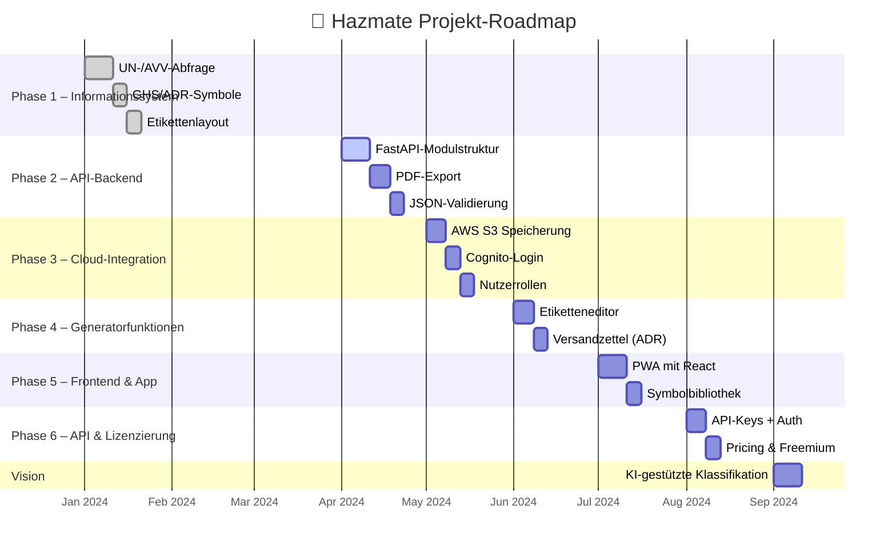

Hazmate – Gefahrgutinformationssystem

1. Projektbeschreibung
2. Funktionsübersicht
3. Technologien & Sicherheit
4. Projektstruktur
5. Setup & Installation
6. API-Funktionalitäten
7. Datenquellen
8. Beispiele
9. Roadmap
10. Fehlerquellen

Produktbeschreibung

**Hazmate** ist eine spezialisierte Webanwendung zur Abfrage von:
- Gefahrgutinformationen (z. B. UN-Nummern, Gefahrgutklassen, Verpackungsgruppen)
- Gefahrstoffdaten (z. B. chemisch-physikalische Eigenschaften)
- Transportvorschriften (z. B. 1000-Punkte-Regel)

## Zielsetzung
Aufbau einer leistungsfähigen und intuitiv bedienbaren Plattform  
für Fachanwender*innen in der Gefahrgutlogistik und Abfallwirtschaft.  
Ziel ist es, die Klassifizierung und Handhabung von Gefahrstoffen **einfacher, schneller und sicherer** zu machen.

## Anwendungsfokus (Version 1)
Die erste Version konzentriert sich vollständig auf die **Informationsabfrage**:

- Identifikation von Gefahrgutabfällen  
- Recherche von Stoffdaten  
- Prüfung von Transportvorgaben gemäß ADR  

### 🛠️ Einsatzbereich der Anwendung

Die Anwendung dient in ihrer ersten Ausbaustufe als:

- 🔍 **Recherche-Tool für Fachanwender**  
  zur gezielten Abfrage von Gefahrgut- und Gefahrstoffinformationen auf Basis strukturierter Datenquellen (z. B. UN-Datenbank, ADR-Vorgaben, AVV-Katalog).

- 🧾 **Digitale Unterstützung bei der Transportvorbereitung**  
  zur Informationsbeschaffung für die spätere Erstellung von Gefahrgutetiketten, Packstückzusammenstellungen oder Beförderungspapieren.

- 📚 **Wissensbasis zur Vorschrifteneinordnung**  
  zur nachvollziehbaren Darstellung von chemisch-physikalischen Eigenschaften, GHS-Kennzeichnungen und Transportvorschriften in verständlicher Form.

---

## 🧭 Strategie

- ✅ **Start**: Reines, stabiles Informationssystem mit klarem Nutzen  
- ⏩ **Weiterentwicklung**: Schrittweises Ergänzen generierender Funktionen  
- 💡 **Prinzip**: *Keep it simple in the beginning*

---

## 🔭 Perspektive

Langfristig wird Hazmate um smarte Funktionen erweitert, darunter:

- 🧠 KI-gestützte Klassifikationsvorschläge und Synonymerkennung  
- 🔌 API-Zugänge zur Anbindung externer Systeme (z. B. ERP oder Entsorgerportale)  
- 📄 Automatisierte Generierung rechtlich konformer Dokumente aus Nutzerinteraktionen  
- 🛎️ Benachrichtigungen über Änderungen in Vorschriften (ADR/Abfallrecht)  
- 💰 Monetarisierungsmodelle: Freemium, Pay-per-Use oder API-Abos

---

## 🎯 Strategisches Ziel

Hazmate verfolgt eine modulare Produktstrategie mit einem schnellen Go-Live auf Basis eines **schlanken, aber funktionalen Kernprodukts**.  
Die Weiterentwicklung erfolgt **iterativ** – gesteuert durch Nutzerfeedback und regulatorische Anforderungen.  
Dabei bleibt eine klare Trennung erhalten zwischen **Informationsabfrage** und **generi
## Inhalt

2. [Funktionsübersicht]: 

## ✅ Version 1 – Informationssystem (MVP)

- 🔍 **UN-Nummern abfragen**  
  Abfrage von Gefahrgutklassen, VerpackungsgruppenGefahrzetteln und Sondervorschriften gemäß ADR.

- 🧪 **Stoffdaten einsehen**  
  Anzeige chemisch-physikalischer Eigenschaften wie Flammpunkt, Aggregatzustand, Toxizität u. v. m.

- ⚠️ **GHS- und ADR-Piktogramme anzeigen**  
  Visualisierung von Gefahrenkennzeichen nach GHS und ADR.

- 🚚 **1000-Punkte-Regel prüfen**  
  Automatisierte Berechnung der Transportpunkte gemäß ADR.

- ♻️ **AVV-Nummern durchsuchen**  
  Klassifikation von Abfällen gemäß Abfallverzeichnis-Verordnung inkl. Gefährlichkeitsbewertung.

- 🔌 **WebSocket-API verwenden**  
  Live-Datenabfragen z. B. über UN-Nummer oder Stoffbezeichnung.

---

## ⏩ Version 2 – Generierende Funktionen (geplant)

- 🧾 **Gefahrgutetiketten generieren**  
  Druckfertige Etiketten auf Basis von UN-Nummer, Gefahrklasse und Verpackungseinheit.

- 📦 **Palettenpacklisten erstellen**  
  Automatische Gruppierung von Stoffen nach Verträglichkeit, Punktebewertung und Ladeeinheit.

- 📄 **ADR-konforme Beförderungspapiere erzeugen (PDF)**  
  Erstellung rechtskonformer Transportdokumente direkt aus der Stoffdatenbank.

- ✍️ **Interaktive Benutzerführung**  
  Schrittweise Eingabehilfe bei der Ermittlung der richtigen Klassifizierung und Transportanforderung.

---

## 🔭 Perspektive – Erweiterungen (langfristig)

- 🧠 **KI-gestützte Klassifizierung**  
  Automatische Vorschläge zur UN- oder AVV-Zuordnung auf Basis von Eingabetext und Merkmalen.

- 🔗 **Externe API-Integration**  
  Anbindung externer Systeme wie ERP, Entsorgerportale oder Behörden-Workflows via REST / WebSocket.

- 🛎️ **Regel-Update-Benachrichtigungen**  
  Hinweis bei Änderungen in ADR-Vorgaben, Abfallrecht oder GHS-System.

- 📚 **Erweiterte Vorschriftenübersicht**  
  Kompakte Erklärungen zu Tunnelbeschränkungscodes, Verpackungsgruppen und Kombinationsverboten.

- 💰 **Monetarisierung & Nutzungsmodelle**  
  Freemium-Modell, API-Zugang per Abonnement oder Pay-per-Use

3. [Technologien &Sicherheit]:

Hazmate basiert auf einem modernen, cloudfähigen Technologie-Stack, der von Beginn an auf Skalierbarkeit, Wartbarkeit und Datenschutz ausgelegt ist.  
Die Architektur erlaubt ein schlankes MVP und gleichzeitig eine modulare Weiterentwicklung entlang des Funktionsausbaus.

---

## ⚙️ Backend

- **FastAPI (Python)**  
  Performantes Framework für REST- und WebSocket-Endpunkte.

- **Pydantic**  
  Datenvalidierung und automatische OpenAPI-Spezifikation.

- **Uvicorn (ASGI)**  
  Server für asynchrone Python-Anwendungen.

- **SQLAlchemy + PostgreSQL**  
  Relationale Datenbankstruktur für Stoff- und Abfalldaten.

- **Redis**  
  Zwischenspeicher für Caching, Rate Limiting und WebSocket-Verwaltung.

---

## 🌐 Frontend

- **Next.js (React-basiert)**  
  Framework mit Server-Side Rendering (SSR) & Static Site Generation (SSG) für performante Webanwendungen.

- **TailwindCSS**  
  Utility-first CSS-Framework für ein klares, modernes UI.

- **ShadCN/UI (optional)**  
  Vorgefertigte React-Komponenten auf Basis von TailwindCSS.

- **Framer Motion**  
  Animationen für reaktive, benutzerfreundliche Oberflächen.

- **React Query / Zustand**  
  State Management und Datenabfragen im Frontend.

---

## ☁️ Infrastruktur & DevOps

- **AWS S3**  
  Speicherung und Verwaltung der JSON-Datenbanken (Stoffe, UN, AVV etc.).

- **AWS API Gateway + Lambda**  
  Skalierbare API-Endpunkte für REST und WebSocket.

- **AWS CloudFront**  
  CDN-Verteilung für Frontend-Assets (Next.js-Builds).

- **Docker**  
  Containerisierung für lokales Dev-Setup und Cloud-Deployments.

- **GitLab / GitHub**  
  Quellcodeverwaltung, CI/CD-Pipelines, Projektkoordination.

---

## 🧪 Testing & Qualitätssicherung

- **Pytest**  
  Tests für das Backend (Funktionalität, Validierung, Routen).

- **Playwright / Cypress (geplant)**  
  End-to-End-Tests für UI-Workflows im Frontend.

- **Lighthouse / Web Vitals**  
  Performance- und UX-Messung für das Web-Frontend.

---

## 🔌 Datenquellen & Schnittstellen

- **JSON-Datenbanken in AWS S3**  
  Konsolidierte Datenquellen für:
  - UN-Nummern und Gefahrklassen
  - Stoffeigenschaften und GHS-Metadaten
  - AVV-Katalog inkl. Gefährlichkeitskennzeichnung

- **ADR / GHS-Metastrukturen**  
  Verpackungsgruppen, Tunnelcodes, Gefahrnummern etc.

- **(geplant)**: externe APIs (PubChem, ECHA, OpenADR)

---

# 🔐 Sicherheit & Compliance

Hazmate wird von Beginn an mit Fokus auf Datenschutz, Integrität und Compliance entwickelt.  
Die Sicherheitsstrategie folgt – wie die Funktionsarchitektur – einem modularen Aufbau, der mit dem System mitwächst.

---

## ✅ Phase 1 – Informationssystem

- **Transportverschlüsselung:**  
  - TLS 1.2 / TLS 1.3 (HTTPS-only) für API- und Frontend-Kommunikation  
  - SSL-Zertifikate über AWS ACM (z. B. für API Gateway und CloudFront)

- **Datenspeicherung (at rest):**  
  - AWS S3 mit aktivierter Server-Side Encryption (`SSE-S3` oder `SSE-KMS`)  
  - Zugriff nur über vorab signierte URLs oder über IAM-gesteuerte Rollen  
  - JSON-Daten (Stoffe, UN, AVV etc.) vollständig verschlüsselt gespeichert

- **Zugriffsrechte & Logging:**  
  - Minimalrechte via AWS IAM (Least Privilege)  
  - S3 Access Logs + optional CloudTrail zur Protokollierung aller Zugriffe

---

## ⏩ Phase 2 – Generierende Funktionen (mit Nutzerinteraktion)

- **Identitäts- & Zugriffsschutz:**  
  - Authentifizierung über AWS Cognito mit OAuth2 / JWT  
  - Session Tokens mit `Secure`, `HttpOnly`, `SameSite=Strict`-Flags

- **Token-Sicherheit:**  
  - Signierte JWTs mit RS256 oder ES256  
  - Refresh Token Mechanismus bei längerer Sessiondauer

- **Datenintegrität & Uploads:**  
  - Hash-/Signaturprüfung bei Dateiübertragungen (z. B. `Content-MD5`)  
  - Optional: Client-seitige Verschlüsselung (AES-256 vor dem Upload)

---

## 🔭 Perspektivisch – Erweiterte Compliance & Sicherheit

- **End-to-End-Verschlüsselung:**  
  - Für besonders schützenswerte Eingabedaten oder Nutzerdokumente

- **Monitoring & Auditing:**  
  - Vollständiges Logging kritischer API-Aktivitäten  
  - Anomalie-Erkennung via AWS GuardDuty oder CloudWatch Alarms

- **Datenschutzkonformität (DSGVO-ready):**  
  - Verarbeitung personenbezogener Daten nur bei aktivierter Zustimmung  
  - Recht auf Auskunft, Löschung und Datenportabilität

- **Compliance-Rahmenwerke:**  
  - Ausrichtung an ISO 27001, BSI IT-Grundschutz, AWS Well-Architected Framework

---

Die Sicherheitsstrategie wird iterativ erweitert – synchron mit den funktionalen Releases von Hazmate.  
So bleibt das System **schlank und performant**, ohne die Anforderungen an **Vertraulichkeit, Integrität und Transparenz** zu vernachlässigen.

4. [Projektstruktur]:

Die Projektstruktur von **Hazmate** ist modular aufgebaut und reflektiert die Trennung zwischen Backend, Frontend, Datenhaltung und Tests.  
Sie unterstützt einen sauberen MVP-Start sowie eine klare Erweiterung im späteren Projektverlauf.

```text
hazmate/
├── app/                    🐍 Python-Backend mit FastAPI
│   ├── main.py             🚀 Einstiegspunkt der FastAPI-App
│   ├── api/                🔁 Routen für REST & WebSocket
│   ├── models/             🧩 Datenmodelle (Pydantic, SQLAlchemy)
│   ├── services/           ⚙️ Fachlogik & Verarbeitung
│   └── config.py           🔐 Sicherheit, Umgebungsvariablen
│
├── frontend/               🌐 Web-Frontend mit Next.js
│   ├── pages/              🗺️ Seitenstruktur (z. B. /suche, /detail)
│   ├── components/         🧱 Wiederverwendbare UI-Komponenten
│   └── styles/             🎨 TailwindCSS & Design-Setup
│
├── data/                   📦 JSON-Datenbanken für Abfragefunktionen
│   ├── avv.json
│   ├── stoffe.json
│   └── un_daten.json
│
├── tests/                  ✅ Unit- und Integrationstests (Pytest)
│   ├── test_api.py
│   └── test_models.py
│
├── Dockerfile              🐳 Backend-Container
├── docker-compose.yml      🔄 Lokale Entwicklung mit Redis, DB etc.
├── .env                    🔧 Umgebungsvariablen (Secrets, Config)
├── README.md               📘 Projektbeschreibung & Einstieg
└── requirements.txt        📎 Python-Abhängigkeiten (Backend)

5. [Setup & Installation]: 

# ⚙️ Setup & Installation

## 🧱 Voraussetzungen

- Python 3.10+
- Node.js 18+ (für das Web-Frontend)
- Docker & Docker Compose (optional)
- Git
- Zugriff auf JSON-Datenbanken (lokal oder via AWS S3)

---

## 🐍 Backend (FastAPI) – Lokales Setup

```bash
# Repository klonen
git clone https://gitlab.com/dein-user/hazmate.git
cd hazmate

# Virtuelle Umgebung erstellen
python3 -m venv venv
source venv/bin/activate  # Windows: venv\\Scripts\\activate

# Abhängigkeiten installieren
pip install -r requirements.txt

# Beispiel-Konfig kopieren und anpassen
cp .env.example .env

# Backend starten
uvicorn app.main:app --reload

## 🌐 Frontend (Next.js) - lokales Setup: 

# In das Frontend-Verzeichnis wechseln
cd frontend

# Abhängigkeiten installieren
npm install

# Entwicklungsserver starten
npm run dev

## ☁️ S3-Datenintegration: 

s3://hazmate-daten/
├── avv_katalog.json
├── un_daten.json
├── stoffdatenbank.json
├── ghs_metadata.json
├── 1000_punkte_regel.json

# .env-Eintrag: 

USE_S3=true
S3_BUCKET_NAME=hazmate-daten
S3_REGION=eu-central-1
AWS_ACCESS_KEY_ID=xxx
AWS_SECRET_ACCESS_KEY=yyy

# 🧩 .py-Beispielcode: 

import boto3, json, os

def load_json_from_s3(key: str):
    if os.getenv("USE_S3") != "true":
        raise RuntimeError("S3 deaktiviert")
    s3 = boto3.client("s3", aws_access_key_id=os.getenv("AWS_ACCESS_KEY_ID"),
                             aws_secret_access_key=os.getenv("AWS_SECRET_ACCESS_KEY"),
                             region_name=os.getenv("S3_REGION"))
    response = s3.get_object(Bucket=os.getenv("S3_BUCKET_NAME"), Key=key)
    return json.loads(response["Body"].read().decode("utf-8"))

avv_data = load_json_from_s3("avv_katalog.json")

## 🔐 Sicherheit & Compliance

Hazmate verfolgt einen Sicherheitsansatz entlang der Entwicklungsphasen – vom reinen Informationssystem bis hin zur interaktiven Plattform mit Benutzerdaten.  
Die Maßnahmen sind technisch konkret und orientieren sich an DSGVO, BSI und ISO 27001.

---

# ✅ Phase 1 – Informationssystem

🔒 Transportverschlüsselung (HTTPS)

- TLS 1.2 / 1.3 über **AWS ACM**
- HTTPS erzwingen über API Gateway / CloudFront

-----------------------------------------------

**Beispiel: Weiterleitung in FastAPI**
```python
@app.middleware("http")
async def enforce_https(request: Request, call_next):
    if request.url.scheme != "https":
        raise HTTPException(status_code=400, detail="HTTPS required")
    return await call_next(request)

-----------------------------------------------

🔒 Datenverschlüsselung in S3: 

Alle .json-Datenbanken (z.B. "stoffdatenbank.json") werden verschlüsselt in S3 gespeichert: 

- Server-Side-Encryption (SSE-KMS)

- Nutzung eigener KMS-Schlüssel über AWS Console oder CLI

-----------------------------------------------

.env-Konfiguration: 

USE_S3=true
S3_BUCKET_NAME=hazmate-daten
S3_REGION=eu-central-1
AWS_ACCESS_KEY_ID=***
AWS_SECRET_ACCESS_KEY=***

Zugriff via boto3: 

s3 = boto3.client("s3")
s3.get_object(Bucket="hazmate-daten", Key="stoffdatenbank.json")

-----------------------------------------------

🔒 Zugriffsschutz & Logging: 

- Buckets sind nicht öffentlich zugänglich 

- Zugriff nur via IAM-Rolle oder pre-signed URL

-----------------------------------------------

Beispiel pre-signed URL: 

s3.generate_presigned_url("get_object", {
    "Bucket": "hazmate-daten",
    "Key": "un_daten.json"
}, ExpiresIn=3600)


S3 Bucket Policy (IAM-basiert, kein public access!)

{
  "Version": "2012-10-17",
  "Statement": [
    {
      "Effect": "Deny",
      "Principal": "*",
      "Action": "s3:*",
      "Resource": "arn:aws:s3:::hazmate-daten/*",
      "Condition": {
        "Bool": {
          "aws:SecureTransport": "false"
        }
      }
    }
  ]
}

-----------------------------------------------

# 🧑‍💻 Phase 2 - Authentifizierung & Sessions: 

- AWS Cognito mit OAuth2 / JWT
Sessions via HttpOnly, Secure, SameSite=Strict

-----------------------------------------------


FastAPI-Header-Validation für JWT

from fastapi import Security, Depends
from fastapi.security import OAuth2PasswordBearer

oauth2_scheme = OAuth2PasswordBearer(tokenUrl="token")

@app.get("/secure-data")
async def secure_data(token: str = Depends(oauth2_scheme)):
    # verify JWT here
    return {"ok": True}

-----------------------------------------------

🔄 Uploads prüfen & absichern

- JSON-Dateien auf Struktur & Gültigkeit prüfen

- Content-Hash prüfen (z. B. Content-MD5)

-----------------------------------------------

Uploadprüfung in FastAPI:

from hashlib import md5

def validate_uploaded_json(file: bytes, expected_hash: str):
    calculated = md5(file).hexdigest()
    if calculated != expected_hash:
        raise HTTPException(400, detail="Hash mismatch")

-----------------------------------------------

# 🔭 Perspektive – Erweiterte Compliance

🛡️ End-to-End-Verschlüsselung

- Verschlüsselung der Nutzdaten auf Clientseite mit z. B. crypto-js (JS)

- Entschlüsselung ausschließlich durch Backend-Schlüsselverwaltung

📊 Monitoring & Audit

- Logging aller kritischen API-Calls via:

- CloudTrail (z. B. s3:GetObject, lambda:InvokeFunction)

- CloudWatch Alarms

- Anomalieerkennung mit AWS GuardDuty

🏛️ Compliance-Rahmenwerke

Hazmate orientiert sich an:

✅ ISO/IEC 27001

✅ BSI IT-Grundschutz

✅ AWS Well-Architected Framework

✅ OWASP Top 10 (u. a. XSS, Broken Auth, Sensitive Data Exposure)

⚖️ DSGVO-Umsetzung

Recht auf Auskunft / Löschung / Export implementieren

Logging & Einwilligung mit Audit-Funktionalität

Dokumentierte Zustimmungspflicht für alle Interaktionen

5. [Installation & Setup]: 

Hazmate lässt sich in mehreren Phasen installieren – beginnend mit einem lokalen Entwicklungssetup, optional erweitert durch Docker und AWS S3-Integration.

-----------------------------------------------

✅ Phase 1 – Lokale Entwicklung (MVP)

🐍 Backend (FastAPI)

```bash
# Repository klonen
git clone https://gitlab.com/dein-user/hazmate.git
cd hazmate

# Virtuelle Umgebung einrichten
python3 -m venv venv
source venv/bin/activate  # Windows: venv\\Scripts\\activate

# Abhängigkeiten installieren
pip install -r requirements.txt

# .env-Datei erstellen und anpassen
cp .env.example .env

# Backend starten (entwicklungsmodus)
uvicorn app.main:app --reload

# Beispiel: GET-Anfrage via curl
curl http://localhost:8000/api/stoff/UN1203

-----------------------------------------------

🌐 Frontend (Next.js)

# In das Frontend-Verzeichnis wechseln
cd frontend

# Abhängigkeiten installieren
npm install

# Entwicklungsserver starten
npm run dev

-----------------------------------------------

⏩ Phase 2 – Containerisierte Umgebung (Docker)

# Docker-Container starten
docker-compose up --build

# Docker-Container stoppen
docker-compose down

----------------------------------------------

Backend und Redis starten automatisch

.env-Dateien werden wie im lokalen Setup verwendet

☁️ Phase 3 – AWS S3-Datenintegration:

-----------------------------------------------


🔧 .env-Konfiguration

USE_S3=true
S3_BUCKET_NAME=hazmate-daten
S3_REGION=eu-central-1
AWS_ACCESS_KEY_ID=dein-access-key
AWS_SECRET_ACCESS_KEY=dein-secret-key

🧩 Beispielhafte Python-Integration

import boto3, json, os

def load_json_from_s3(key: str):
    s3 = boto3.client(
        "s3",
        aws_access_key_id=os.getenv("AWS_ACCESS_KEY_ID"),
        aws_secret_access_key=os.getenv("AWS_SECRET_ACCESS_KEY"),
        region_name=os.getenv("S3_REGION")
    )
    response = s3.get_object(Bucket=os.getenv("S3_BUCKET_NAME"), Key=key)
    return json.loads(response["Body"].read().decode("utf-8"))

🧪 Test mit AWS CLI

aws s3 cp s3://hazmate-daten/un_daten.json ./data/un_daten.json

-----------------------------------------------

🧪 Phase 4 – Tests & Codequalität


# Backend-Tests mit Pytest
pytest tests/

# Test einzelner Datei
pytest tests/test_api.py

# Codequalität prüfen
flake8 app/

6. [API Funktionalitäten]:

## 🔌 API-Integration

Hazmate stellt über **FastAPI** eine leistungsfähige API zur Verfügung, mit der Gefahrgut-, Abfall- und Stoffdaten abgefragt werden können.  
Die API ist modular aufgebaut und unterstützt REST, WebSocket und externe Dienste wie **PubChem**.


# ⚙️ Grundlage: FastAPI

-----
Hazmate nutzt [FastAPI](https://fastapi.tiangolo.com/) als Backend-Framework.

-----

- Schnelle, asynchrone Python-API
- Integrierte automatische Validierung via Pydantic
- Auto-generierte OpenAPI-Spezifikation (Swagger UI)
- WebSocket- und REST-Support out-of-the-box

-----------------------------------------------

Beispiel:

```python
from fastapi import FastAPI

app = FastAPI()

@app.get("/api/status")
def read_status():
    return {"status": "running"}

-----------------------------------------------

✅ REST-Endpunkte (Phase 1)

# 📦 Stoffdaten (UN-Nummer)

-----------------------------------------------

GET /api/stoff/{un_nummer}

Beispiel:

GET /api/stoff/1203

Antwort:

{
  "un": "1203",
  "bezeichnung": "Benzin",
  "klasse": "3",
  "verpackungsgruppe": "II"
}

-----------------------------------------------

# ♻️ AVV-Daten

-----------------------------------------------

GET /api/avv/{nummer}

Beispiel:

GET /api/avv/150110

Antwort:

{
  "avv": "150110",
  "bezeichnung": "Verpackungen mit gefährlichen Rückständen",
  "gefährlich": true
}

-----------------------------------------------

# 🚚 1000-Punkte-Regel

-----------------------------------------------

POST /api/punkte

Body:

{
  "un": "1263",
  "menge_liter": 10,
  "verpackungsgruppe": "I"
}

Antwort:

{
  "punkte": 500,
  "klassifizierung": "Teilbefreiung überschritten"
}

-----------------------------------------------


⏩ WebSocket API (Phase 2):

-----------------------------------------------


ws://localhost:8000/ws

Nachricht senden:

{
  "action": "get_substance_info",
  "data": {
    "un_number": "1203"
  }
}

Antwort:

{
  "un": "1203",
  "bezeichnung": "Benzin"
}

-----------------------------------------------

🌐 PubChem-Integration (Phase 3)

Hazmate nutzt optional die PubChem API für erweiterte chemische Informationen.

-----------------------------------------------

GET /api/pubchem/{name}

Beispiel:

GET /api/pubchem/Acetone

Antwort:

{
  "name": "Acetone",
  "molecular_formula": "C3H6O",
  "molecular_weight": "58.08",
  "inchi": "InChI=1S/C3H6O/...",
  "smiles": "CC(=O)C"
}

-----------------------------------------------

🧪 Dev- & Monitoring-Endpunkte

-----------------------------------------------

GET /api/status
GET /api/info

-----------------------------------------------

→ Zur Prüfung von API-Verfügbarkeit, Build-Info oder Umgebungsstatus.

📚 Dokumentation & Tools

Swagger UI: http://localhost:8000/docs

OpenAPI JSON: http://localhost:8000/openapi.json

Verwende Tools wie httpx, curl, Postman oder eigene Clients zur Integration


7. Datenquellen:

🗂️ Datenquellen (lokal & geprüft)

Hazmate nutzt strukturierte JSON-Dateien, die lokal oder über AWS S3 eingebunden werden.  
Diese Daten bilden die Basis für alle Klassifizierungs- und Abfragefunktionen.

-----------------------------------------------

📁 Beispielstruktur lokal:

```text
/data/
├── avv_katalog.json
├── stoffdatenbank.json
├── un_daten.json
├── ghs_metadata.json
├── 1000_punkte_regel.json
├── gefahrgutklassen.json
└── klassifizierungscodes.json

-----------------------------------------------

☁️ S3-Speicherstruktur

s3://hazmate-daten/

→ Zugriff über das Backend (boto3) oder AWS CLI
→ Authentifizierung via .env-Konfiguration

-----------------------------------------------

USE_S3=true
S3_BUCKET_NAME=hazmate-daten
AWS_REGION=eu-central-1

-----------------------------------------------

✅ Validierung mit JSON Schema

→ Jede Validierung wird beim Laden automatisch geprüft:

-----------------------------------------------

import json, jsonschema
with open("datenquellen.schema.json") as s, open("un_daten.json") as d:
    schema = json.load(s)
    data = json.load(d)
jsonschema.validate(instance=data, schema=schema)

-----------------------------------------------

🧩 Beispielschema 
datenquellen.schema.json

-----------------------------------------------

{
  "type": "object",
  "properties": {
    "un": { "type": "string" },
    "klasse": { "type": "string" },
    "verpackungsgruppe": { "type": "string" }
  },
  "required": ["un", "klasse", "verpackungsgruppe"]
}

-----------------------------------------------

→ Weitere Schemas können z. B. für avv_katalog.json oder stoffdatenbank.json definiert werden.


8. Beispiele:

-----------------------------------------------

# 📱 UN 1993 – mit AVV-Zuordnung - Mobile Mockup

@router.get("/api/stoff/{un_nummer}")
def get_un_info(un_nummer: str):
    eintrag = next((x for x in UN_DATA if x["un"] == un_nummer), None)
    if not eintrag:
        raise HTTPException(404, detail="UN-Nummer nicht gefunden")
    # AVV-Vorschläge anhand Mapping
    avv_mapping = {
        "1993": ["070704", "160506"]
    }
    eintrag["verknuepfte_avv"] = avv_mapping.get(un_nummer, [])
    return eintrag

╭────────────────────────────────────╮
│     HAZMATE – UN-Abfrage Mobile    │
│ 🔍 UN-Nummer oder Stoff eingeben   │
├────────────────────────────────────┤
│ Eingabe: [ 1 9 9 3 ]        [🔎]    │
├────────────────────────────────────┤

✅ Ergebnis für UN 1993:
╔════════════════════════════════════╗
║ 🧪 Stoff: Entzündbarer flüssiger   ║
║      Stoff, n.a.g. (z. B. Aceton) ║
║ 🚛 Klasse:        3                ║
║ 📦 Verpackung:    Gruppe II        ║
║ 🔥 Flammpunkt:    < 23 °C          ║
║ 🧾 Gefahrnummer:  33               ║
║ ⚠️ Gefahrzettel:  [GHS02]          ║
╚════════════════════════════════════╝

🔁 Verpackungsgruppe basiert auf SDB
  → II = mittlere Gefahr ✅

📊 ADR 1.1.3.6 – 1000-Punkte-Regel:
  → Kategorie 2 → Faktor 3  
  → 10 L x 3 = 30 Punkte

🧮 Tools:
[ Punkte berechnen ]  [ Etikett generieren ]
[ In PubChem anzeigen ]  [ ADR-Vorschriften ]

📂 Passende AVV-Nummern:
- **160506***: Laborchemikalien mit gefährlichen Stoffen  
- **070704***: Andere organische Lösemittel, Waschflüssigkeiten, Mutterlaugen  

📤 Export:
[ PDF ]  [ CSV ]  [ QR-Code ]

-----------------------------------------------

# ♻️ AVV-Abfrage – Mobile Mockup

@router.get("/api/avv/{nummer}")
def get_avv_info(nummer: str):
    eintrag = next((x for x in AVV_DATA if x["avv"] == nummer), None)
    if not eintrag:
        raise HTTPException(404, detail="AVV nicht gefunden")
    # UN-Vorschläge anhand Stoffart oder Klassifizierung
    eintrag["moegliche_un_nummern"] = ["1993", "1987"]
    return eintrag

╭────────────────────────────────────╮
│       HAZMATE – AVV-Abfrage        │
│ 🔍 Abfallschlüssel eingeben        │
├────────────────────────────────────┤
│ Eingabe: [ 16 05 06 * ]     [🔎]    │
├────────────────────────────────────┤

✅ Ergebnis für AVV 160506*:
╔════════════════════════════════════╗
║ ♻️ Abfallart:                      ║
║ Laborchemikalien mit Gefahrenstoff║
║ 📁 Kategorie: Organisch, Flüssig   ║
║ ⚠️ Gefährlich: Ja (Stern markiert) ║
╚════════════════════════════════════╝

🔗 Verknüpfte UN-Nummern:
- UN 1993: entzündbare Flüssigkeiten, n.a.g.
- UN 1987: Alkohole, n.a.g.
- UN 2924: Entzündbar & ätzend (gemischt)

🛠️ Aktionen:
[ GHS prüfen ] [ Entsorgungsprofil ] [ ADR-Vorgabe ]

📤 Export: [ PDF ] [ CSV ] [ QR ]

-----------------------------------------------

# 🚚 1000-Punkte-Regel – Mobile Mockup

@router.post("/api/punkte")
def berechne_punkte(eingabe: dict):
    faktoren = {"I": 50, "II": 3, "III": 1}
    menge = eingabe["menge_liter"]
    gruppe = eingabe["verpackungsgruppe"]
    faktor = faktoren.get(gruppe, 0)
    punkte = menge * faktor
    return {
        "punkte": punkte,
        "klassifizierung": (
            "Teilbefreiung überschritten" if punkte >= 1000
            else "Befreit nach ADR 1.1.3.6"
        )
    }

╭────────────────────────────────────╮
│   HAZMATE – ADR 1.1.3.6 Rechner     │
│ 🧮 1000-Punkte-Berechnung           │
├────────────────────────────────────┤
│ UN: [ 1 9 9 3 ]                     │
│ Menge: [ 10 ] L                    │
│ Verpackung: [ II ] ▼               │
├────────────────────────────────────┤

📊 Ergebnis:
╔════════════════════════════════════╗
║ ADR-Kategorie: 2 → Faktor 3        ║
║ Berechnung: 10 L x 3 = 30 Punkte   ║
║ ➕ Summe Gesamtladung: 470 Punkte  ║
║ ✅ Teilbefreiung möglich           ║
╚════════════════════════════════════╝

🛠️ Aktionen:
[ Weitere Stoffe hinzufügen ]
[ Punkte zurücksetzen ]
[ Gesamtberechnung exportieren ]

-----------------------------------------------

# 🏷️ Etikettengenerator – Mobile Mockup

@router.post("/api/etikett")
def generiere_etikett(daten: dict):
    etikett = {
        "un": daten["un"],
        "stoff": daten["bezeichnung"],
        "verpackung": daten["verpackungsgruppe"],
        "ghs": daten.get("gefahrzettel", []),
        "klasse": daten["klasse"]
    }
    # Optional: SVG oder PDF-Export integrieren
    return etikett

╭────────────────────────────────────╮
│     HAZMATE – Etikettengenerator   │
│ 🏷️ UN-Etikett erstellen            │
├────────────────────────────────────┤
│ UN-Nummer: [ 1 9 9 3 ]             │
│ Stoffname: [ entz. Flüssigkeit ]  │
│ Verpackungsgruppe: [ II ]         │
│ Gefahrzettel: [GHS02]             │
├────────────────────────────────────┤

📐 Vorschau:
╔════════════════════════════════════╗
║ 🚛 UN 1993                         ║
║ 🧪 ENTZÜNDBARER FLÜSSIGER STOFF    ║
║ ⚠️ [GHS02]                         ║
║ 📦 Verpackungsgruppe: II          ║
╚════════════════════════════════════╝

🛠️ Optionen:
[ SVG generieren ] [ PDF speichern ] [ QR-Code drucken ]

-----------------------------------------------

# 🧾 Gefahrgut-Label (10x15cm) mit QR Code- Mobile Mockup

from qrcode import make as make_qr

@router.get("/api/etikett/pdf")
def erstelle_label(un: str):
    eintrag = get_un_info(un)
    qr_data = f"https://hazmate.app/un/{un}"
    qr_img = make_qr(qr_data)
    # Kombiniere mit Etikettenlayout (SVG/PDF)
    return {"etikett": eintrag, "qr_code": qr_data}

╔════════════════════════════════════╗
║            HAZMATE LABEL          ║
║        GEFÄHRGUT-ETIKETT          ║
╚════════════════════════════════════╝

UN-Nummer:        1993
Bezeichnung:      Entzündbarer flüssiger Stoff, n.a.g.
Zusatz:           z. B. Aceton
Verpackungsgruppe: II
Gefahrgutklasse:  3 – Entzündbar

────────────────────────────────────

ADR-Gefahrzettel:
[ 🔺  KL. 3 – ENTZÜNDBAR | ROTES DREIECK ]

GHS-Kennzeichnung:
[ ◯  GHS02 ] – Flamme

────────────────────────────────────

Absender:
Labor XY  
Musterstraße 12  
12345 Beispielstadt

Empfänger:
Entsorger GmbH  
Entsorgungsweg 99  
54321 Abfallstadt

────────────────────────────────────

Hinweis:
Nicht mit Zündquellen in Berührung bringen.

📎 QR-Code:
┌─────┐
│ ▓░█ │
│ █▓░ │  → hazmate.app/un/1993
│ ░▓█ │
└─────┘

-----------------------------------------------

hazmate API Modul:

hazmate_api_module.py

from fastapi import FastAPI, HTTPException, APIRouter from qrcode import make as make_qr

app = FastAPI() router = APIRouter()

📦 Beispielhafte Datenstrukturen (Mock-Daten)

UN_DATA = [ {"un": "1993", "bezeichnung": "Entzündbarer flüssiger Stoff, n.a.g.", "klasse": "3", "verpackungsgruppe": "II", "gefahrzettel": ["GHS02"]} ]

AVV_DATA = [ {"avv": "160506", "bezeichnung": "Laborchemikalien mit gefährlichen Stoffen"}, {"avv": "070704", "bezeichnung": "Organische Lösemittel, Mutterlaugen"} ]

🔍 UN-Abfrage mit AVV-Zuordnung

@router.get("/api/stoff/{un_nummer}") def get_un_info(un_nummer: str): # Suche nach UN-Nummer eintrag = next((x for x in UN_DATA if x["un"] == un_nummer), None) if not eintrag: raise HTTPException(404, detail="UN-Nummer nicht gefunden") # Verknüpfte AVV-Vorschläge (statisch zugeordnet) avv_mapping = {"1993": ["070704", "160506"]} eintrag["verknuepfte_avv"] = avv_mapping.get(un_nummer, []) return eintrag

♻️ AVV-Abfrage mit UN-Vorschlägen

@router.get("/api/avv/{nummer}") def get_avv_info(nummer: str): # Suche nach AVV-Nummer eintrag = next((x for x in AVV_DATA if x["avv"] == nummer), None) if not eintrag: raise HTTPException(404, detail="AVV nicht gefunden") # Beispielhafte UN-Vorschläge eintrag["moegliche_un_nummern"] = ["1993", "1987"] return eintrag

🚚 1000-Punkte-Regel Berechnung

@router.post("/api/punkte") def berechne_punkte(eingabe: dict): faktoren = {"I": 50, "II": 3, "III": 1} menge = eingabe["menge_liter"] gruppe = eingabe["verpackungsgruppe"] faktor = faktoren.get(gruppe, 0) punkte = menge * faktor return { "punkte": punkte, "klassifizierung": ( "Teilbefreiung überschritten" if punkte >= 1000 else "Befreit nach ADR 1.1.3.6" ) }

🏷️ Etikettengenerator

@router.post("/api/etikett") def generiere_etikett(daten: dict): # Generiere ein einfaches Etikett-Objekt etikett = { "un": daten["un"], "stoff": daten["bezeichnung"], "verpackung": daten["verpackungsgruppe"], "ghs": daten.get("gefahrzettel", []), "klasse": daten["klasse"] } return etikett

🧾 Etikett mit QR-Code (z. B. für PDF oder Druck)

@router.get("/api/etikett/pdf") def erstelle_label(un: str): # Hole UN-Datensatz eintrag = next((x for x in UN_DATA if x["un"] == un), None) if not eintrag: raise HTTPException(404, detail="UN nicht gefunden") # Erstelle QR-Code-Link qr_data = f"https://hazmate.app/un/{un}" qr_img = make_qr(qr_data) # Rückgabe mit QR-Link return {"etikett": eintrag, "qr_code": qr_data}

app.include_router(router)

-----------------------------------------------

## Etiketten Vorschau: 

<!DOCTYPE html><html lang="de">
<head>
  <meta charset="UTF-8" />
  <meta name="viewport" content="width=device-width, initial-scale=1.0" />
  <title>Hazmate Etikett</title>
  <style>
    body {
      font-family: sans-serif;
      background: #fff;
      padding: 1cm;
      max-width: 10cm;
      border: 1px solid #000;
    }
    h1 {
      font-size: 1.2em;
      text-align: center;
      margin: 0 0 0.5em;
    }
    .section {
      margin-bottom: 0.8em;
    }
    .label {
      font-weight: bold;
    }
    .symbol {
      width: 60px;
      height: 60px;
      object-fit: contain;
      display: inline-block;
      margin-top: 0.3em;
    }
    .qr {
      width: 80px;
      height: 80px;
      float: right;
    }
  </style>
</head>
<body>
  <h1>⚠️ HAZMATE – GEFÄHRGUT-ETIKETT</h1>  <div class="section">
    <div class="label">UN-Nummer:</div>
    <span id="un">...</span><br />
    <div class="label">Bezeichnung:</div>
    <span id="bezeichnung">...</span><br />
    <div class="label">Verpackungsgruppe:</div>
    <span id="verpackung">...</span><br />
    <div class="label">Gefahrgutklasse:</div>
    <span id="klasse">...</span>
  </div>  <div class="section">
    <div class="label">ADR-Gefahrzettel:</div>
    
  </div>  <div class="section">
    <div class="label">GHS-Kennzeichnung:</div>
    
  </div>  <div class="section">
    <div class="label">Absender:</div>
    <span id="absender">...</span><br />
    <div class="label">Empfänger:</div>
    <span id="empfaenger">...</span>
  </div>  <div class="section">
    <div class="label">Hinweis:</div>
    <span id="hinweis">...</span>
  </div>  <div class="section">
    <div class="label">QR-Code:</div>
    
  </div>  <script>
    // Dynamische API-Befüllung
    fetch("/api/etikett?un=1993")
      .then(res => res.json())
      .then(data => {
        document.getElementById("un").textContent = data.un;
        document.getElementById("bezeichnung").textContent = data.stoff;
        document.getElementById("verpackung").textContent = data.verpackung;
        document.getElementById("klasse").textContent = data.klasse;
        document.getElementById("absender").textContent = "Labor XY, Musterstraße 12, Beispielstadt";
        document.getElementById("empfaenger").textContent = "Entsorger GmbH, Entsorgungsweg 99, Abfallstadt";
        document.getElementById("hinweis").textContent = "Transport gemäß ADR. Nicht mit Zündquellen in Berührung bringen.";
      });
  </script></body>
</html>

-----------------------------------------------

9. Roadmap: 

## 🗺️ Roadmap (mit Status-Badges)

Hazmate wird iterativ aufgebaut. Der aktuelle Stand pro Entwicklungsphase ist unten als Fortschrittsbalken und Badge dargestellt.

---

### ✅ Phase 1 – Informationssystem


- UN-/AVV-Suche  
- ADR/GHS-Klassifikation  
- Etiketten-Vorlagen  
- QR-Code  
- Textdarstellung

---

### 🛠️ Phase 2 – API & Daten


- FastAPI-Endpunkte ✔️  
- Symbolintegration ✔️  
- HTML-Vorschau ✔️  
- PDF-Export ⏳  
- JSON-Validierung ⏳

---

### ☁️ Phase 3 – Cloud & User


- AWS S3 Speicher  
- Cognito-Login  
- Rollen & Rechte  
- Änderungsverfolgung  

---

### 🚀 Phase 4 – Generatoren


- Etiketten-Editor (Drag & Drop)  
- Versanddokumente (ADR-konform)  
- CSV/PDF-Ausgabe  
- Vorschlagslogik

---

### 🌐 Phase 5 – Web & PWA


- React / Next.js Frontend  
- Offline-Nutzung (PWA)  
- Symbol-Explorer  
- Mobile Etiketten-App

---

### 📦 Phase 6 – Externe API & Lizenzierung


- Externer Zugriff per API-Key  
- Zugriffslimits  
- Preismodelle & Pay-per-Use  
- Partnerzugänge

---

### 🧠 Vision


- KI-gestützte Klassifikation  
- Visualisierung globaler Regeln  
- Plugin-System für Labore & Entsorger

-----------------------------------------------

# 📊 Hazmate – Kombinierte Mermaid-Diagramme

## 🗺️ Projekt-Roadmap



---

## 🔧 Systemübersicht (Flowchart)

```mermaid
flowchart TD
    A[User Interface / PWA] --> B[FastAPI Backend]
    B --> C1[UN-Datenbank (JSON / S3)]
    B --> C2[AVV-Datenbank (JSON / S3)]
    B --> C3[GHS / ADR Symbolverzeichnis]
    B --> D[Etikettengenerator (HTML/SVG/PDF)]
    B --> E[1000-Punkte-Berechnung]
    D --> F[QR-Code-Generator]
    F --> G[(hazmate.app/un/1993)]

    classDef data fill:#f2f2f2,stroke:#888;
    class C1,C2,C3 data;
```

-----------------------------------------------

10. Fehlerquellen

Typische Stolperfallen bei der Nutzung von Hazmate – inklusive Lösungen und Hilfestellungen.

-----------------------------------------------

<details>
<summary>🔄 API antwortet nicht?</summary>

- Stelle sicher, dass das Backend aktiv ist:
  ```bash
  uvicorn app.main:app --reload

-----------------------------------------------

- Prüfe, ob Port 8000 durch ein anderes Tool blockiert wird

- Docker? Portfreigabe prüfen (-p 8000:8000)

# 📂 JSON-Daten werden nicht geladen?</summary>Prüfe Pfade (/data/*.json oder S3-Verlinkung)

JSON-Dateien müssen UTF-8 und gültige Struktur haben

Pflichtfelder: "un", "klasse", "verpackungsgruppe"

python -m json.tool < deine_datei.json


# 🧾 PDF-/SVG-Export zeigt leere Seite?</summary>Alle Etikettenfelder müssen korrekt befüllt sein

GHS/ADR-Daten fehlen?

Feature ggf. im Entwicklungsstatus

# 🧠 Gefahrensymbole (SVG) werden nicht geladen?</summary>SVG-Dateien wie ghs02.svg müssen im Pfad assets/ oder public/ liegen

Pfade prüfen & Groß-/Kleinschreibung beachten

Alternativ CDN nutzen

# 🧮 Punkteberechnung gibt 0 zurück?</summary>Eingabemenge ≥ 1 Liter?

Verpackungsgruppe korrekt (I, II, III)?

Rechenfaktor vorhanden?


# hazmate-readme

